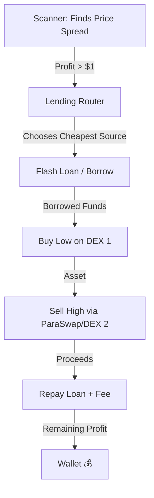
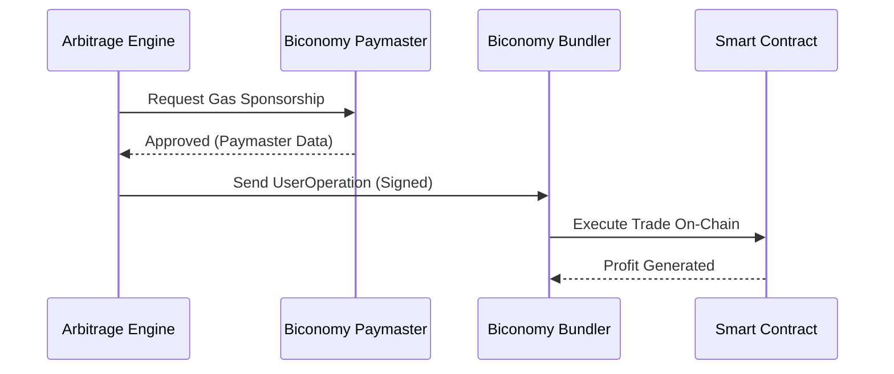
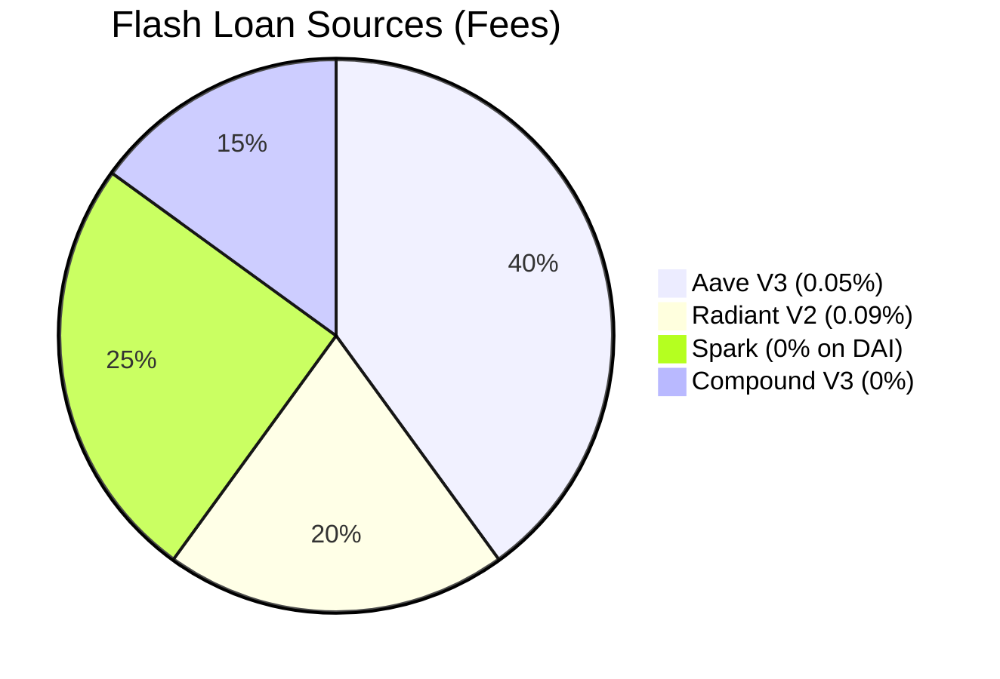

# ⚡ Crypto Arbitrage Pro v3.0


## 🌍 English Description
**Crypto Arbitrage Pro** is an advanced, production-ready Decentralized Finance (DeFi) trading bot. It automatically scans 59 Decentralized Exchanges (DEXs) across 6 blockchains to detect price discrepancies. It uses zero-collateral **Flash Loans** (from Aave V3, Radiant V2, Spark, and Compound V3) to fund trades, executes the arbitrage through a smart contract, and pays gas fees via **Biconomy Paymaster** (ERC-4337 Account Abstraction), meaning you pay **zero upfront gas fees**.

### Key Features:
- **No Capital Required:** Uses Flash Loans to borrow millions, trade, and repay in a single transaction.
- **Gasless Execution:** Integrates Biconomy to sponsor gas fees or pay them from trade profits (Token Paymaster).
- **Statistical Intelligence (v3.0):** The bot learns from past trades, auto-blacklists failing DEX pairs, and ranks opportunities by a confidence score.
- **ParaSwap V5 Routing (v3.0):** Sells assets through ParaSwap aggregator to ensure maximum profitability.
- **Dynamic Lending Router (v3.0):** Automatically chooses the cheapest flash loan source (e.g., 0% fee on Spark for DAI).

---

## 🇲🇦 الوصف باللغة العربية (الدارجة)
**Crypto Arbitrage Pro** هو روبوت (Bot) متطور ومصمم للعمل الحقيقي فمجال التمويل اللامركزي (DeFi). هاد الروبوت كيقلب فـ 59 منصة تداول (DEX) على 6 شبكات بلوكتشين مختلفة باش يلقى فروقات فالثمن ديال العملات. الميزة الوعرة فيه هي أنك **ماكتحتاجش راس مال**؛ كيتسلف الفلوس عن طريق **القروض الخاطفة (Flash Loans)**، كيشري ويبيع، كيرد السلف، وكيخلي ليك الربح فثانية وحدة. زائد أنك **ماكتخلصش رسوم الغاز (Gas Fees)** حيت خدام بـ Biconomy لي كيسبونصري العمليات!

### أهم المميزات:
- **بدون رأس مال:** كيتسلف الملايين عبر Flash Loans من (Aave V3, Radiant V2, Spark, Compound V3).
- **بدون رسوم غاز:** كيستعمل Biconomy باش يخلص الغاز بلاصتك، أو كيقطعو من الأرباح.
- **ذكاء إحصائي (v3.0):** البوت كيتعلم من الصفقات القديمة، كيبلوكي المنصات الفاشلة، وكيرتب الفرص حسب نسبة النجاح.
- **البيع بأعلى سعر (v3.0):** كيدوز البيع عبر ParaSwap باش يضمن أحسن ثمن فالسوق.
- **الاختيار الذكي للقرض (v3.0):** كيختار أرخص بلاصة يتسلف منها أوتوماتيكياً (مثلا 0% اقتطاع على Spark).

---

## ⚙️ How It Works / كيفاش خدام؟

### 1. The Core Logic (منطق المراجحة)
The bot continuously scans DEXs for price differences. When a profitable spread is found, it initiates a Flash Loan.
*(الروبوت كيقلب على فرق فالثمن، ملي كيلقاه، كيتسلف الفلوس وكيشري رخيص ويبيع غالي فنفس اللحظة)*



### 2. Gasless Execution via Biconomy (تنفيذ بدون غاز)
Instead of broadcasting to the public mempool where front-runners operate, transactions are sent as `UserOperations` to a Biconomy Bundler.
*(المعاملات كتمشي لـ Biconomy بلاصة البلوكتشين ديريكت، هادشي كيحميك من الروبوتات المنافسة وكيعفيك من رسوم الغاز)*



### 3. Smart Lending Router (توجيه القروض الذكي)
The bot compares 4 different lending protocols to find the cheapest flash loan fee based on the token and available liquidity.
*(البوت كيقارن 4 ديال البنوك لامركزية، وكيختار الأرخص باش يخلي ليك ربح صافي أكبر)*



---

## 🛠️ Setup Guide / طريقة التشغيل

### 1. Install Dependencies
```bash
npm install
```

### 2. Environment Variables
Rename `.env.example` to `.env` and fill in your keys:
```env
ALCHEMY_API_KEY=your_alchemy_key
BICONOMY_API_KEY=your_biconomy_key
PRIVATE_KEY=your_wallet_private_key
NEXT_PUBLIC_CHAIN_ID=42161 # Arbitrum Mainnet
```

### 3. Run the Bot
```bash
npm run dev
```
Open `http://localhost:3000` to view the Dashboard.

*(دير `npm install` موراها قاد ملف `.env` وحط فيه الـ API ديالك، ومن بعد ديماري المشروع بـ `npm run dev`)*

---

## 🛡️ Security
This project includes standard smart contract protections:
- **Slippage Protection (`minAmountOut`)**: Reverts if the trade becomes unprofitable due to price movement.
- **Flash Loan Safety Net**: Reverts the entire transaction if the loan cannot be repaid. You lose exactly zero dollars.

*(المشروع محمي 100%. إيلا الثمن تبدل فجأة والصفقة خسرات، العقد الذكي كيلغي المعاملة كاملة من الساس وماكتخسر حتى سنتيم)*

## 📄 License
MIT License.
