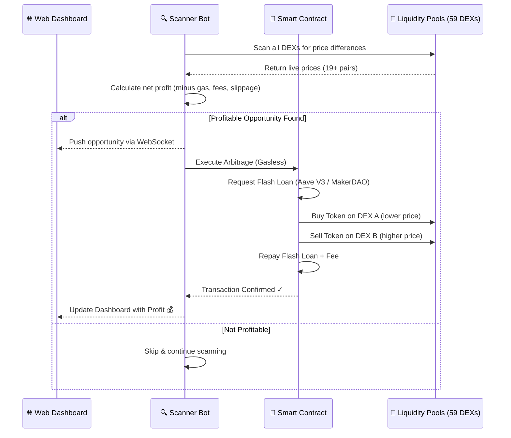
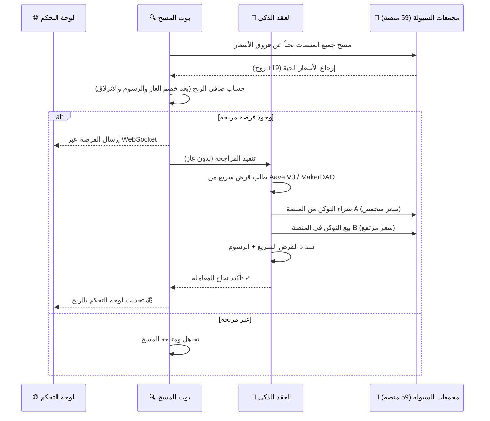

# ⚡ Crypto Arbitrage Pro

[English](#english) | [العربية](#arabic)

<div align="center">


**Advanced Multi-Chain Crypto Arbitrage Platform — Zero Capital • Zero Gas Fees • Zero Risk**

</div>

---

<a name="english"></a>
## 🇬🇧 English

### Overview

**Crypto Arbitrage Pro** is an institutional-grade, multi-chain cryptocurrency arbitrage platform that automatically detects and executes profitable arbitrage opportunities across **59 decentralized exchanges** spanning **6 blockchain networks**. Using cutting-edge Web3 primitives — Flash Loans, Flash Swaps, and Flash Mints — the platform executes trades without requiring any upfront capital, with all gas fees paid directly from the arbitrage profits via Biconomy's Gasless Paymaster.

The platform combines a real-time Next.js dashboard with a high-frequency Node.js scanning engine and battle-tested Solidity smart contracts to deliver a complete, end-to-end arbitrage infrastructure.

---

### Core Features

| Feature | Description |
|---------|-------------|
| **Multi-Chain Scanning** | Monitors 59 DEXs across 6 chains (Arbitrum, Ethereum, Base, Optimism, Polygon, BSC) |
| **Real-Time Detection** | Scans 19+ trading pairs every 3 seconds with adaptive intervals |
| **Zero Capital Required** | Executes via Flash Loans — no upfront investment needed |
| **Gasless Execution** | Biconomy Paymaster pays all gas fees from profits |
| **MEV Protection** | Flashbots relay integration prevents front-running and sandwich attacks |
| **Triangular Arbitrage** | Multi-hop path detection (A→B→C→A) for complex opportunities |
| **Smart Mode** | Statistical trade memory ranks opportunities by historical success rate |
| **Dual Network Mode** | Switch between Mainnet and Testnet for risk-free testing |
| **Custom Tokens** | Add any token address to monitor custom pairs |
| **Auto-Execute** | Fully automated execution with configurable profit thresholds |
| **Detailed Simulation** | Step-by-step trade simulation before committing capital |

---

### Architecture Blueprint

```
┌─────────────────────────────────────────────────────────────────┐
│                     FRONTEND (Next.js 14)                        │
│  ┌──────────┐ ┌──────────┐ ┌──────────┐ ┌──────────────────┐  │
│  │ Header   │ │Stats Grid│ │Opp Table │ │ Execution Panel  │  │
│  └──────────┘ └──────────┘ └──────────┘ └──────────────────┘  │
│  ┌──────────┐ ┌──────────┐ ┌──────────┐ ┌──────────────────┐  │
│  │Price Chart│ │DEX View  │ │Calculator│ │ History / Logs   │  │
│  └──────────┘ └──────────┘ └──────────┘ └──────────────────┘  │
│                        ↕ WebSocket                              │
├─────────────────────────────────────────────────────────────────┤
│                    BACKEND (Node.js + Express)                    │
│  ┌──────────────────────────────────────────────────────────┐  │
│  │ Scanner → Price Aggregator → ArbEngine → Executor         │  │
│  └──────────────────────────────────────────────────────────┘  │
│  ┌──────────┐ ┌──────────┐ ┌──────────┐ ┌──────────────────┐  │
│  │ RPC Mgr  │ │Price Feed│ │Trade Mem │ │ Lending Router   │  │
│  └──────────┘ └──────────┘ └──────────┘ └──────────────────┘  │
│  ┌──────────┐ ┌──────────┐                                    │
│  │ParaSwap  │ │ Paymaster│                                    │
│  └──────────┘ └──────────┘                                    │
│                        ↕ RPC (ethers.js)                        │
├─────────────────────────────────────────────────────────────────┤
│              SMART CONTRACTS (Solidity 0.8.20)                   │
│  ┌─────────────────────────────────────────────────────────┐   │
│  │ FlashLoanArbitrage  │ FlashSwapArbitrage                 │   │
│  │ FlashMintArbitrage  │ MultiHopRouter                     │   │
│  └─────────────────────────────────────────────────────────┘   │
│                        ↕ On-Chain                               │
├─────────────────────────────────────────────────────────────────┤
│                   BLOCKCHAIN NETWORKS                            │
│  ┌──────────┐ ┌──────────┐ ┌──────────┐ ┌──────────────────┐  │
│  │ Arbitrum │ │ Ethereum │ │   Base   │ │Optimism/Poly/BNB │  │
│  └──────────┘ └──────────┘ └──────────┘ └──────────────────┘  │
│  ┌──────────────────────────────────────────────────────────┐  │
│  │ Aave V3 • MakerDAO • Uniswap V2/V3 • Biconomy • Flashbots│  │
│  └──────────────────────────────────────────────────────────┘  │
└─────────────────────────────────────────────────────────────────┘
```

---

### How It Works — Execution Flow



### Flash Loan Providers

| Provider | Strategy | Fee | Max Loan | Best For |
|----------|----------|-----|----------|----------|
| **Aave V3** | Flash Loan | 0.09% | Unlimited | General arbitrage |
| **Uniswap V2** | Flash Swap | 0.3% | Pool liquidity | V2 pair arbitrage |
| **MakerDAO** | Flash Mint | **0%** | 500M DAI | DAI-based arbitrage |
| **Lending Router** | Automatic | Optimized | Dynamic | Auto-selects cheapest |

### Lending Sources

| Protocol | Type | Chain | Fee |
|----------|------|-------|-----|
| Aave V3 | Lending Pool | Arbitrum, Ethereum, Optimism, Polygon, Base | 0.09% |
| MakerDAO | Flash Mint | Ethereum | 0% |
| Uniswap V2 | Flash Swap | All chains | 0.3% |
| ParaSwap | DEX Aggregator | All chains | Variable |

---

### Complete DEX Registry (59 Mainnet + 4 Testnet)

#### Arbitrum (20 DEXs)

| # | DEX | Type | Router / Vault | Fee |
|---|-----|------|----------------|-----|
| 1 | 🦄 Uniswap V3 | V3 | `0xE592427...5861564` | 0.3% |
| 2 | 🦄 Uniswap V2 | V2 | `0x4752ba5...372aD24` | 0.3% |
| 3 | 🍣 SushiSwap | V2 | `0x1b02dA8...47997506` | 0.3% |
| 4 | 🐪 Camelot | V2 | `0xc873fEc...1db2448d` | 0.3% |
| 5 | 🥞 PancakeSwap V3 | V3 | `0x1b81D67...213eB14` | 0.25% |
| 6 | 🧑‍🌾 TraderJoe | V2 | `0xb4315e8...20fB30` | 0.3% |
| 7 | ⚖️ Balancer | Balancer | `0xBA12222...6BF2C8` | 0.1% |
| 8 | 🌀 Curve | Curve | `0xF0d4c12...c58b8D` | 0.04% |
| 9 | 🎲 GMX V2 | GMX | `0xaBBc5F9...2F4064` | 0.3% |
| 10 | 🏛️ Ramses | Solidly | `0xAAA8796...cb1805e` | 0.3% |
| 11 | ⏰ Chronos | Solidly | `0xE708aA9...a34f3b` | 0.3% |
| 12 | ⚡ ZyberSwap | V2 | `0x16e71B1...Ad32Ad` | 0.25% |
| 13 | 🐕 WOOFi | V2 | `0x9aEd3A8...629a30` | 0.025% |
| 14 | 🦤 DODO | V2 | `0x88CBf43...4593E5` | 0.1% |
| 15 | 💎 KyberSwap | V2 | `0x6131B5f...66337b5` | 0.3% |
| 16 | 🏦 FraxSwap | V2 | `0xaBBc5F9...2F4064` | 0.3% |
| 17 | 🐟 SwapFish | V2 | `0xcDAeC65...4f30d8` | 0.3% |
| 18 | 🔄 ArbiDex | V2 | `0x7238FB4...1A8a8` | 0.3% |
| 19 | 🦎 SolidLizard | Solidly | `0xF26515D...4b3D0` | 0.3% |
| 20 | 🍪 OreoSwap | V2 | `0x38eEd6a...381AEC` | 0.3% |

#### Ethereum (12 DEXs)

| # | DEX | Type | Router / Vault | Fee |
|---|-----|------|----------------|-----|
| 21 | 🦄 Uniswap V2 | V2 | `0x7a250d5...F2488D` | 0.3% |
| 22 | 🦄 Uniswap V3 | V3 | `0xE592427...5861564` | 0.3% |
| 23 | 🍣 SushiSwap | V2 | `0xd9e1cE1...78B9F` | 0.3% |
| 24 | 🌀 Curve 3Pool | Curve | `0xbEbc447...2FF1C7` | 0.04% |
| 25 | 🌀 Curve TriCrypto | Curve | `0xD51a44d...fAAE46` | 0.04% |
| 26 | ⚖️ Balancer | Balancer | `0xBA12222...6BF2C8` | 0.1% |
| 27 | 🥞 PancakeSwap V3 | V3 | `0x13f4EA8...568Dd4` | 0.25% |
| 28 | 🦤 DODO | V2 | `0xa356867...231FdC` | 0.1% |
| 29 | 🐕 ShibaSwap | V2 | `0x03f7724...6b329` | 0.3% |
| 30 | 🏦 FraxSwap | V2 | `0xC14d550...03867` | 0.3% |
| 31 | 🦅 Maverick | V2 | `0x11C907C...E28F` | 0.3% |
| 32 | 💠 DeFi Swap | V2 | `0xCeB90E4...a181b3` | 0.3% |

#### Base (10 DEXs)

| # | DEX | Type | Router / Vault | Fee |
|---|-----|------|----------------|-----|
| 33 | ✈️ Aerodrome | Solidly | `0xcF77a3B...874E43` | 0.3% |
| 34 | 🔵 BaseSwap | V2 | `0x327Df1E...505d86` | 0.3% |
| 35 | 🍣 SushiSwap | V2 | `0xFB7eF66...49b9f` | 0.3% |
| 36 | 🦄 Uniswap V3 | V3 | `0x2626664...741e481` | 0.3% |
| 37 | 🥞 PancakeSwap V3 | V3 | `0x1b81D67...213eB14` | 0.25% |
| 38 | ⚖️ Balancer | Balancer | `0xBA12222...6BF2C8` | 0.1% |
| 39 | 🌀 Curve | Curve | `0xF0d4c12...c58b8D` | 0.04% |
| 40 | 💫 SwapBased | V2 | `0xaaa3b1F...31F066` | 0.3% |
| 41 | 👽 AlienBase | V2 | `0x8c1A3cF...6b37c7` | 0.3% |
| 42 | 🦆 DackieSwap | V2 | `0x591f122...6d6551` | 0.3% |

#### Optimism (6 DEXs)

| # | DEX | Type | Router / Vault | Fee |
|---|-----|------|----------------|-----|
| 43 | 🏎️ Velodrome | Solidly | `0xa062aE8...8B2858` | 0.3% |
| 44 | 🦄 Uniswap V3 | V3 | `0xE592427...5861564` | 0.3% |
| 45 | 🍣 SushiSwap | V2 | `0x1b02dA8...47997506` | 0.3% |
| 46 | 🌀 Curve | Curve | `0xF0d4c12...c58b8D` | 0.04% |
| 47 | 🎵 Beethoven X | Balancer | `0xBA12222...6BF2C8` | 0.1% |
| 48 | 💎 KyberSwap | V2 | `0x6131B5f...66337b5` | 0.3% |

#### Polygon (6 DEXs)

| # | DEX | Type | Router / Vault | Fee |
|---|-----|------|----------------|-----|
| 49 | 🐉 QuickSwap V3 | V3 | `0xf5b509b...68E12` | 0.3% |
| 50 | 🦄 Uniswap V3 | V3 | `0xE592427...5861564` | 0.3% |
| 51 | 🍣 SushiSwap | V2 | `0x1b02dA8...47997506` | 0.3% |
| 52 | ⚖️ Balancer | Balancer | `0xBA12222...6BF2C8` | 0.1% |
| 53 | 🌀 Curve | Curve | `0xF0d4c12...c58b8D` | 0.04% |
| 54 | 🦤 DODO | V2 | `0xa222e6a...d0e70` | 0.1% |

#### BNB Chain / BSC (5 DEXs)

| # | DEX | Type | Router / Vault | Fee |
|---|-----|------|----------------|-----|
| 55 | 🥞 PancakeSwap V2 | V2 | `0x10ED43C...56024E` | 0.25% |
| 56 | 🥞 PancakeSwap V3 | V3 | `0x13f4EA8...568Dd4` | 0.25% |
| 57 | 🔁 BiSwap | V2 | `0x3a6d8cA...3350dD8` | 0.1% |
| 58 | 🦤 DODO | V2 | `0x8F8Dd7D...d58486` | 0.1% |
| 59 | 🦍 ApeSwap | V2 | `0xcF0feBd...Bf3b7` | 0.2% |

#### Testnet DEXs (4)

| # | DEX | Type | Chain | Fee |
|---|-----|------|-------|-----|
| T1 | 🦄 Uniswap V2 | V2 | Sepolia | 0.3% |
| T2 | 🦄 Uniswap V3 | V3 | Sepolia | 0.3% |
| T3 | 🦄 Uniswap V3 | V3 | Arb Sepolia | 0.3% |
| T4 | 🥞 PancakeSwap V2 | V2 | BSC Testnet | 0.25% |

### DEX Types Supported

| Type | Description | Examples |
|------|-------------|----------|
| **V2 (AMM)** | Constant product AMM | Uniswap V2, SushiSwap, Camelot |
| **V3 (Concentrated)** | Concentrated liquidity | Uniswap V3, PancakeSwap V3, QuickSwap V3 |
| **Curve** | Stable-swap optimized | Curve 3Pool, Curve TriCrypto |
| **Balancer** | Multi-asset weighted pools | Balancer, Beethoven X |
| **Solidly** | Ve(3,3) AMM forks | Ramses, Chronos, Aerodrome, Velodrome, SolidLizard |
| **GMX** | Oracle-based perpetual DEX | GMX V2 |

---

### Smart Contracts

| Contract | File | Description | Source |
|----------|------|-------------|--------|
| **FlashLoanArbitrage** | `contracts/FlashLoanArbitrage.sol` | Aave V3 Flash Loan arbitrage with multi-hop swap routing | Aave V3 |
| **FlashSwapArbitrage** | `contracts/FlashSwapArbitrage.sol` | Uniswap V2 Flash Swap arbitrage (borrow + repay in same tx) | Uniswap V2 |
| **FlashMintArbitrage** | `contracts/FlashMintArbitrage.sol` | MakerDAO Flash Mint — mint DAI, swap, burn (0% fee) | MakerDAO |
| **MultiHopRouter** | `contracts/MultiHopRouter.sol` | Triangular and multi-hop arbitrage route executor | Custom |

**Security Features:**
- OpenZeppelin `ReentrancyGuard` on all contracts
- `SafeERC20` for all token transfers
- Owner/Operator access control pattern
- Emergency pause mechanism (`setPaused`)
- Rescue functions for stuck tokens/ETH
- Only verified pool contracts can call `executeOperation`

---

### Tracked Trading Pairs

The scanner monitors **19+ token pairs** across chains:

| Chain | Pairs |
|-------|-------|
| **Arbitrum** | WETH/USDC, WETH/USDT, WBTC/USDC, ARB/USDC, ARB/WETH, LINK/USDC, UNI/USDC, GMX/WETH, USDC/USDC.e, USDC/USDT, USDC/DAI, DAI/USDT |
| **Ethereum** | WETH/USDC, WETH/USDT, WBTC/USDC, USDC/DAI, USDC/USDT |
| **Base** | WETH/USDC, USDC/USDbC |

Loan amounts tested: $1,000 • $5,000 • $10,000 • $50,000 • $100,000

---

### Profit Calculation Formula

```
Gross Return = LoanAmount × (SellDEX_Price / BuyDEX_Price)

- Flash Loan Fee  (Aave: 0.09%, Maker: 0%)
- DEX Fees        (already reflected in quoted prices)
- Gas Cost        = TotalGasUnits × GasPriceGwei × ETH_Price_USD / 1e9
- Slippage        = GrossProfit × 0.5%

= Net Profit
```

The engine also applies a **confidence score** (0-100) based on:
- Liquidity depth (high/medium/low)
- Spread quality (% difference)
- Price freshness (age of quote)
- Profit magnitude ($ amount)
- Profit percentage sanity check (very high % = likely stale data)

---

### Tech Stack

| Layer | Technology |
|-------|-----------|
| **Frontend** | Next.js 14, TypeScript, Tailwind CSS, Zustand, Recharts, Framer Motion |
| **Backend** | Node.js, Express, WebSocket (ws), ethers.js v6, axios |
| **Smart Contracts** | Solidity 0.8.20, Hardhat, OpenZeppelin Contracts v5 |
| **Blockchain** | Arbitrum, Ethereum, Base, Optimism, Polygon, BNB Chain |
| **Infrastructure** | Biconomy Paymaster (Gasless), Flashbots (MEV Protection) |
| **Protocols** | Aave V3, MakerDAO, Uniswap V2/V3, Curve, Balancer |

---

### Quick Start

```bash
# 1. Clone the repository
git clone https://github.com/chemrah/crypto-arb-pro.git
cd crypto-arb-pro

# 2. Install dependencies
npm install

# 3. Configure environment
cp .env.example .env
# Edit .env with your RPC URLs, Private Key, and Biconomy API Key

# 4. Run the application
npm run dev:all

# 5. Open http://localhost:3000
```

For detailed setup instructions, see [QUICKSTART.md](QUICKSTART.md) and [IMPLEMENTATION_GUIDE.md](IMPLEMENTATION_GUIDE.md).

---

### Available Scripts

| Script | Description |
|--------|-------------|
| `npm run dev` | Start Next.js frontend |
| `npm run server` | Start backend scanner + API |
| `npm run dev:all` | Start both frontend + backend |
| `npm run build` | Build for production |
| `npm run compile` | Compile smart contracts (Hardhat) |
| `npm test` | Run smart contract tests |
| `npm run deploy:testnet` | Deploy contracts to Arbitrum Sepolia |

---

### API Endpoints

| Endpoint | Method | Description |
|----------|--------|-------------|
| `/api/health` | GET | Server health, uptime, clients |
| `/api/opportunities` | GET | Latest arbitrage opportunities |
| `/api/stats` | GET | Scan statistics and totals |
| `/api/prices` | GET | Current prices across all DEXs |
| `/api/dexes` | GET | List of supported DEXs |
| `/api/pairs` | GET | Currently tracked trading pairs |
| `/api/simulate` | POST | Simulate a trade with given params |
| `/api/execute` | POST | Execute an arbitrage opportunity |
| `/api/execute/simulate` | POST | Pre-execution simulation |
| `/api/network` | GET/POST | Get/set network mode |
| `/api/auto-execute` | POST | Toggle auto-execution |
| `/api/bot-mode` | GET/POST | Get/set bot intelligence mode |
| `/api/trade-stats` | GET | Historical trade statistics |
| `/api/lending-sources` | GET | Available flash loan providers |
| `/api/custom-tokens` | GET/POST/DELETE | Manage custom token tracking |

### WebSocket Events

| Event | Direction | Description |
|-------|-----------|-------------|
| `connected` | Server→Client | Initial connection with full state |
| `new_opportunity` | Server→Client | New arbitrage opportunity detected |
| `execution_started` | Server→Client | Trade execution has begun |
| `execution_step` | Server→Client | Step-by-step execution progress |
| `execution_confirmed` | Server→Client | Trade successfully executed |
| `execution_failed` | Server→Client | Trade execution failed |
| `price_update` | Server→Client | Real-time price updates |
| `scan_update` | Server→Client | Scan cycle statistics |
| `auto_execute_result` | Server→Client | Result of auto-execution |

---

### Environment Variables

```env
# Required
PRIVATE_KEY=your_wallet_private_key
BICONOMY_API_KEY=your_biconomy_key
ARBITRUM_RPC=https://arb1.arbitrum.io/rpc

# Optional
ETH_RPC=https://eth.llamarpc.com
BASE_RPC=https://mainnet.base.org
PORT=3001
NETWORK_MODE=mainnet
MIN_PROFIT_USD=1
AUTO_EXECUTE=false
FLASHBOTS_RELAY=https://relay.flashbots.net
```

---

### Project Structure

```
crypto-arb-pro/
├── app/                          # Next.js Frontend
│   ├── components/
│   │   ├── Header.tsx            # Navigation bar
│   │   ├── StatsGrid.tsx         # Real-time statistics
│   │   ├── OpportunityTable.tsx  # Live opportunities table
│   │   ├── OpportunityDetail.tsx # Opportunity details
│   │   ├── PriceChart.tsx        # Price charts
│   │   ├── DexOverview.tsx       # DEX status overview
│   │   ├── ExecutionPanel.tsx    # Trade execution panel
│   │   ├── ExecutionHistory.tsx  # Trade history
│   │   ├── ProfitCalculator.tsx  # Profit calculator
│   │   ├── BotModeSelector.tsx   # Bot intelligence mode
│   │   ├── LendingSourceSelector.tsx  # Flash loan source
│   │   └── CustomTokenManager.tsx     # Custom token manager
│   ├── page.tsx                  # Main page
│   ├── layout.tsx                # Root layout
│   └── globals.css               # Global styles
├── server/                       # Node.js Backend
│   ├── index.js                  # Express + WebSocket server
│   ├── services/
│   │   ├── scanner.js            # Market scanner engine
│   │   ├── dex-prices.js         # Multi-DEX price aggregator
│   │   ├── arbitrage-engine.js   # Profit calculator + strategy
│   │   ├── executor.js           # Gasless transaction executor
│   │   ├── rpc-manager.js        # Multi-chain RPC manager
│   │   ├── price-feed.js         # Live ETH/gas price feed
│   │   ├── paymaster.js          # Biconomy paymaster service
│   │   ├── paraswap.js           # ParaSwap DEX aggregator
│   │   ├── lending-router.js     # Flash loan source router
│   │   └── trade-memory.js       # Statistical trade memory
│   └── dex/
│       └── abis.js               # 59 DEX registry + ABIs
├── contracts/                    # Solidity Smart Contracts
│   ├── FlashLoanArbitrage.sol    # Aave V3 Flash Loan
│   ├── FlashSwapArbitrage.sol    # Uniswap V2 Flash Swap
│   ├── FlashMintArbitrage.sol    # MakerDAO Flash Mint
│   └── MultiHopRouter.sol        # Multi-hop routing
├── lib/                          # Shared libraries
│   ├── store.ts                  # Zustand state management
│   ├── websocket.ts              # WebSocket client
│   └── wallet.ts                 # Wallet utilities
├── scripts/
│   ├── deploy.js                 # Contract deployment script
│   └── health-check.js           # System health check
├── data/
│   └── custom-tokens.json        # User-defined token tracking
├── .github/
│   └── workflows/                # GitHub Actions CI/CD
│       ├── test.yml              # Automated tests
│       ├── deploy-contracts.yml  # Contract deployment
│       ├── deploy-app.yml        # Application deployment
│       ├── release.yml           # Release management
│       ├── monitor.yml           # Production monitoring
│       └── security.yml          # Security scanning
├── package.json
├── hardhat.config.js
├── next.config.js
├── tailwind.config.js
└── tsconfig.json
```

---

### Documentation

| Document | Description |
|----------|-------------|
| [README.md](README.md) | Main documentation (this file) |
| [QUICKSTART.md](QUICKSTART.md) | 5-minute quick start guide |
| [IMPLEMENTATION_GUIDE.md](IMPLEMENTATION_GUIDE.md) | Full implementation guide |
| [GITHUB_GUIDE.md](GITHUB_GUIDE.md) | GitHub deployment guide |
| [PROJECT_SUMMARY.md](PROJECT_SUMMARY.md) | Project summary (Arabic) |
| [CONTRIBUTING.md](CONTRIBUTING.md) | Contribution guidelines |
| [SECURITY.md](SECURITY.md) | Security policy |
| [CODE_OF_CONDUCT.md](CODE_OF_CONDUCT.md) | Code of conduct |
| [CHANGELOG.md](CHANGELOG.md) | Version history |

---

### Statistics

```
📦 Total Files:     50+
📝 Lines of Code:   10,000+
🖥️ Frontend Components: 11
⚡ Smart Contracts:  4
🏦 DEXs Supported:  59 (Mainnet) + 4 (Testnet)
🔗 Blockchains:     6 (Arbitrum, Ethereum, Base, Optimism, Polygon, BSC)
🔄 Tracked Pairs:   19+
💰 Flash Loan Sources: 4
🤖 GitHub Workflows: 6
📚 Documentation:   9 files
```

---

### License

MIT License — see [LICENSE](LICENSE) for details.

---

### Disclaimer

This project is for **educational and research purposes**. Cryptocurrency trading involves substantial risk. The authors assume no responsibility for financial losses incurred through use of this software. Always test thoroughly on testnets before deploying to mainnet.

---

<a name="arabic"></a>
## 🇸🇦 العربية

### نظرة عامة

**Crypto Arbitrage Pro** هي منصة احترافية متعددة السلاسل للمراجحة (Arbitrage) في أسواق العملات الرقمية، مصممة لاكتشاف وتنفيذ فرص التداول المربحة تلقائياً عبر **59 منصة تداول لامركزية (DEX)** موزعة على **6 شبكات بلوكتشين**. باستخدام أحدث تقنيات Web3 — القروض السريعة (Flash Loans)، والمبادلات السريعة (Flash Swaps)، والسك السريع (Flash Mints) — تنفذ المنصة الصفقات دون الحاجة إلى أي رأس مال مسبق، مع تغطية جميع رسوم الغاز مباشرة من أرباح المراجحة عبر نظام Biconomy Gasless Paymaster.

تجمع المنصة بين لوحة تحكم فورية (Next.js) ومحرك مسح عالي التردد (Node.js) وعقود ذكية محكمة (Solidity) لتقديم بنية تحتية كاملة للمراجحة الآلية.

---

### الميزات الأساسية

| الميزة | الوصف |
|--------|-------|
| **مسح متعدد السلاسل** | مراقبة 59 منصة DEX عبر 6 شبكات (Arbitrum, Ethereum, Base, Optimism, Polygon, BSC) |
| **كشف فوري** | مسح 19+ زوج تداول كل 3 ثوانٍ بفواصل زمنية متكيفة |
| **بدون رأس مال** | تنفيذ عبر القروض السريعة — لا حاجة لاستثمار مسبق |
| **تنفيذ بدون غاز** | Biconomy Paymaster يدفع جميع رسوم الغاز من الأرباح |
| **حماية من MEV** | تكامل مع Flashbots Relay لمنع هجمات Front-running و Sandwich |
| **مراجحة مثلثية** | كشف المسارات متعددة القفزات (A→B→C→A) |
| **الوضع الذكي** | ذاكرة تداول إحصائية ترتب الفرص حسب نسبة النجاح التاريخية |
| **وضعي الشبكة** | تبديل بين Mainnet و Testnet للاختبار الآمن |
| **توكنات مخصصة** | إضافة أي عنوان توكن لمراقبة أزواج مخصصة |
| **تنفيذ تلقائي** | تنفيذ آلي بالكامل مع عتبات ربح قابلة للتكوين |
| **محاكاة مفصلة** | محاكاة خطوة بخطوة قبل تنفيذ الصفقة |

---

### الهيكلة العامة (Blueprint)

```
┌─────────────────────────────────────────────────────────────────┐
│                  الواجهة الأمامية (Next.js 14)                    │
│  ┌──────────┐ ┌──────────┐ ┌──────────┐ ┌──────────────────┐  │
│  │ الشريط   │ │الإحصائيات│ │جدول الفرص│ │  لوحة التنفيذ    │  │
│  └──────────┘ └──────────┘ └──────────┘ └──────────────────┘  │
│  ┌──────────┐ ┌──────────┐ ┌──────────┐ ┌──────────────────┐  │
│  │الرسوم    │ │المنصات   │ │الحاسبة   │ │  السجل والإعدادات│  │
│  └──────────┘ └──────────┘ └──────────┘ └──────────────────┘  │
│                        ↕ WebSocket                              │
├─────────────────────────────────────────────────────────────────┤
│                 الخادم الخلفي (Node.js + Express)                 │
│  ┌──────────────────────────────────────────────────────────┐  │
│  │ الماسح ← مجمع الأسعار ← محرك المراجحة ← المنفذ              │  │
│  └──────────────────────────────────────────────────────────┘  │
│  ┌──────────┐ ┌──────────┐ ┌──────────┐ ┌──────────────────┐  │
│  │ مدير RPC │ │تغذية السعر│ │ذاكرة التداول│ │موجه الإقراض     │  │
│  └──────────┘ └──────────┘ └──────────┘ └──────────────────┘  │
│  ┌──────────┐ ┌──────────┐                                    │
│  │ParaSwap  │ │ Paymaster│                                    │
│  └──────────┘ └──────────┘                                    │
│                        ↕ RPC (ethers.js)                        │
├─────────────────────────────────────────────────────────────────┤
│                العقود الذكية (Solidity 0.8.20)                   │
│  ┌─────────────────────────────────────────────────────────┐   │
│  │ FlashLoanArbitrage  │ FlashSwapArbitrage                 │   │
│  │ FlashMintArbitrage  │ MultiHopRouter                     │   │
│  └─────────────────────────────────────────────────────────┘   │
│                        ↕ On-Chain                               │
├─────────────────────────────────────────────────────────────────┤
│                   شبكات البلوكتشين                               │
│  ┌──────────┐ ┌──────────┐ ┌──────────┐ ┌──────────────────┐  │
│  │ Arbitrum │ │Ethereum  │ │   Base   │ │Optimism/Poly/BNB│  │
│  └──────────┘ └──────────┘ └──────────┘ └──────────────────┘  │
│  ┌──────────────────────────────────────────────────────────┐  │
│  │Aave V3 • MakerDAO • Uniswap V2/V3 • Biconomy • Flashbots │  │
│  └──────────────────────────────────────────────────────────┘  │
└─────────────────────────────────────────────────────────────────┘
```

---

### آلية العمل — مسار التنفيذ



---

### مزودو القروض السريعة

| المزود | الاستراتيجية | الرسوم | الحد الأقصى | الأفضل لـ |
|--------|-------------|--------|------------|-----------|
| **Aave V3** | قرض سريع | 0.09% | غير محدود | المراجحة العامة |
| **Uniswap V2** | مبادلة سريعة | 0.3% | سيولة المجمع | مراجحة أزواج V2 |
| **MakerDAO** | سك سريع | **0%** | 500M DAI | المراجحة المعتمدة على DAI |
| **موجه الإقراض** | تلقائي | الأمثل | ديناميكي | اختيار الأرخص تلقائياً |

---

### سجل المنصات الكامل (59 منصة رئيسية + 4 اختبارية)

#### Arbitrum (20 منصة)

| # | المنصة | النوع | عنوان العقد الذكي | الرسوم |
|---|--------|-------|-------------------|--------|
| 1 | 🦄 Uniswap V3 | V3 | `0xE592427...5861564` | 0.3% |
| 2 | 🦄 Uniswap V2 | V2 | `0x4752ba5...372aD24` | 0.3% |
| 3 | 🍣 SushiSwap | V2 | `0x1b02dA8...47997506` | 0.3% |
| 4 | 🐪 Camelot | V2 | `0xc873fEc...1db2448d` | 0.3% |
| 5 | 🥞 PancakeSwap V3 | V3 | `0x1b81D67...213eB14` | 0.25% |
| 6 | 🧑‍🌾 TraderJoe | V2 | `0xb4315e8...20fB30` | 0.3% |
| 7 | ⚖️ Balancer | Balancer | `0xBA12222...6BF2C8` | 0.1% |
| 8 | 🌀 Curve | Curve | `0xF0d4c12...c58b8D` | 0.04% |
| 9 | 🎲 GMX V2 | GMX | `0xaBBc5F9...2F4064` | 0.3% |
| 10 | 🏛️ Ramses | Solidly | `0xAAA8796...cb1805e` | 0.3% |
| 11 | ⏰ Chronos | Solidly | `0xE708aA9...a34f3b` | 0.3% |
| 12 | ⚡ ZyberSwap | V2 | `0x16e71B1...Ad32Ad` | 0.25% |
| 13 | 🐕 WOOFi | V2 | `0x9aEd3A8...629a30` | 0.025% |
| 14 | 🦤 DODO | V2 | `0x88CBf43...4593E5` | 0.1% |
| 15 | 💎 KyberSwap | V2 | `0x6131B5f...66337b5` | 0.3% |
| 16 | 🏦 FraxSwap | V2 | `0xaBBc5F9...2F4064` | 0.3% |
| 17 | 🐟 SwapFish | V2 | `0xcDAeC65...4f30d8` | 0.3% |
| 18 | 🔄 ArbiDex | V2 | `0x7238FB4...1A8a8` | 0.3% |
| 19 | 🦎 SolidLizard | Solidly | `0xF26515D...4b3D0` | 0.3% |
| 20 | 🍪 OreoSwap | V2 | `0x38eEd6a...381AEC` | 0.3% |

#### Ethereum (12 منصة)

| # | المنصة | النوع | عنوان العقد الذكي | الرسوم |
|---|--------|-------|-------------------|--------|
| 21 | 🦄 Uniswap V2 | V2 | `0x7a250d5...F2488D` | 0.3% |
| 22 | 🦄 Uniswap V3 | V3 | `0xE592427...5861564` | 0.3% |
| 23 | 🍣 SushiSwap | V2 | `0xd9e1cE1...78B9F` | 0.3% |
| 24 | 🌀 Curve 3Pool | Curve | `0xbEbc447...2FF1C7` | 0.04% |
| 25 | 🌀 Curve TriCrypto | Curve | `0xD51a44d...fAAE46` | 0.04% |
| 26 | ⚖️ Balancer | Balancer | `0xBA12222...6BF2C8` | 0.1% |
| 27 | 🥞 PancakeSwap V3 | V3 | `0x13f4EA8...568Dd4` | 0.25% |
| 28 | 🦤 DODO | V2 | `0xa356867...231FdC` | 0.1% |
| 29 | 🐕 ShibaSwap | V2 | `0x03f7724...6b329` | 0.3% |
| 30 | 🏦 FraxSwap | V2 | `0xC14d550...03867` | 0.3% |
| 31 | 🦅 Maverick | V2 | `0x11C907C...E28F` | 0.3% |
| 32 | 💠 DeFi Swap | V2 | `0xCeB90E4...a181b3` | 0.3% |

#### Base (10 منصات)

| # | المنصة | النوع | عنوان العقد الذكي | الرسوم |
|---|--------|-------|-------------------|--------|
| 33 | ✈️ Aerodrome | Solidly | `0xcF77a3B...874E43` | 0.3% |
| 34 | 🔵 BaseSwap | V2 | `0x327Df1E...505d86` | 0.3% |
| 35 | 🍣 SushiSwap | V2 | `0xFB7eF66...49b9f` | 0.3% |
| 36 | 🦄 Uniswap V3 | V3 | `0x2626664...741e481` | 0.3% |
| 37 | 🥞 PancakeSwap V3 | V3 | `0x1b81D67...213eB14` | 0.25% |
| 38 | ⚖️ Balancer | Balancer | `0xBA12222...6BF2C8` | 0.1% |
| 39 | 🌀 Curve | Curve | `0xF0d4c12...c58b8D` | 0.04% |
| 40 | 💫 SwapBased | V2 | `0xaaa3b1F...31F066` | 0.3% |
| 41 | 👽 AlienBase | V2 | `0x8c1A3cF...6b37c7` | 0.3% |
| 42 | 🦆 DackieSwap | V2 | `0x591f122...6d6551` | 0.3% |

#### Optimism (6 منصات)

| # | المنصة | النوع | عنوان العقد الذكي | الرسوم |
|---|--------|-------|-------------------|--------|
| 43 | 🏎️ Velodrome | Solidly | `0xa062aE8...8B2858` | 0.3% |
| 44 | 🦄 Uniswap V3 | V3 | `0xE592427...5861564` | 0.3% |
| 45 | 🍣 SushiSwap | V2 | `0x1b02dA8...47997506` | 0.3% |
| 46 | 🌀 Curve | Curve | `0xF0d4c12...c58b8D` | 0.04% |
| 47 | 🎵 Beethoven X | Balancer | `0xBA12222...6BF2C8` | 0.1% |
| 48 | 💎 KyberSwap | V2 | `0x6131B5f...66337b5` | 0.3% |

#### Polygon (6 منصات)

| # | المنصة | النوع | عنوان العقد الذكي | الرسوم |
|---|--------|-------|-------------------|--------|
| 49 | 🐉 QuickSwap V3 | V3 | `0xf5b509b...68E12` | 0.3% |
| 50 | 🦄 Uniswap V3 | V3 | `0xE592427...5861564` | 0.3% |
| 51 | 🍣 SushiSwap | V2 | `0x1b02dA8...47997506` | 0.3% |
| 52 | ⚖️ Balancer | Balancer | `0xBA12222...6BF2C8` | 0.1% |
| 53 | 🌀 Curve | Curve | `0xF0d4c12...c58b8D` | 0.04% |
| 54 | 🦤 DODO | V2 | `0xa222e6a...d0e70` | 0.1% |

#### BNB Chain (5 منصات)

| # | المنصة | النوع | عنوان العقد الذكي | الرسوم |
|---|--------|-------|-------------------|--------|
| 55 | 🥞 PancakeSwap V2 | V2 | `0x10ED43C...56024E` | 0.25% |
| 56 | 🥞 PancakeSwap V3 | V3 | `0x13f4EA8...568Dd4` | 0.25% |
| 57 | 🔁 BiSwap | V2 | `0x3a6d8cA...3350dD8` | 0.1% |
| 58 | 🦤 DODO | V2 | `0x8F8Dd7D...d58486` | 0.1% |
| 59 | 🦍 ApeSwap | V2 | `0xcF0feBd...Bf3b7` | 0.2% |

#### منصات الاختبار (4)

| # | المنصة | النوع | السلسلة | الرسوم |
|---|--------|-------|---------|--------|
| T1 | 🦄 Uniswap V2 | V2 | Sepolia | 0.3% |
| T2 | 🦄 Uniswap V3 | V3 | Sepolia | 0.3% |
| T3 | 🦄 Uniswap V3 | V3 | Arb Sepolia | 0.3% |
| T4 | 🥞 PancakeSwap V2 | V2 | BSC Testnet | 0.25% |

---

### أنواع المنصات المدعومة

| النوع | الوصف | أمثلة |
|-------|-------|-------|
| **V2 (AMM)** | صانع سوق آلي بمنتج ثابت | Uniswap V2, SushiSwap, Camelot |
| **V3 (مركزة)** | سيولة مركزة | Uniswap V3, PancakeSwap V3, QuickSwap V3 |
| **Curve** | مُحسّن للعملات المستقرة | Curve 3Pool, Curve TriCrypto |
| **Balancer** | مجمعات متعددة الأصول | Balancer, Beethoven X |
| **Solidly** | نسخ Ve(3,3) | Ramses, Chronos, Aerodrome, Velodrome, SolidLizard |
| **GMX** | منصة عقود دائمة | GMX V2 |

---

### العقود الذكية

| العقد | الملف | الوصف | المصدر |
|-------|------|-------|--------|
| **FlashLoanArbitrage** | `contracts/FlashLoanArbitrage.sol` | مراجحة عبر قرض Aave V3 السريع مع توجيه متعدد القفزات | Aave V3 |
| **FlashSwapArbitrage** | `contracts/FlashSwapArbitrage.sol` | مراجحة عبر مبادلة Uniswap V2 السريعة | Uniswap V2 |
| **FlashMintArbitrage** | `contracts/FlashMintArbitrage.sol` | سك DAI عبر MakerDAO ثم مبادلة وحرق (بدون رسوم) | MakerDAO |
| **MultiHopRouter** | `contracts/MultiHopRouter.sol` | منفذ مسارات المراجحة المثلثية ومتعددة القفزات | مخصص |

**ميزات الأمان:**
- `ReentrancyGuard` من OpenZeppelin على جميع العقود
- `SafeERC20` لجميع تحويلات التوكنات
- نمط تحكم Owner/Operator
- آلية إيقاف طارئ (`setPaused`)
- دوال إنقاذ للتوكنات/ETH العالقة
- فقط عقود المجمعات الموثقة يمكنها استدعاء `executeOperation`

---

### أزواج التداول المراقبة

| الشبكة | الأزواج |
|--------|---------|
| **Arbitrum** | WETH/USDC, WETH/USDT, WBTC/USDC, ARB/USDC, ARB/WETH, LINK/USDC, UNI/USDC, GMX/WETH, USDC/USDC.e, USDC/USDT, USDC/DAI, DAI/USDT |
| **Ethereum** | WETH/USDC, WETH/USDT, WBTC/USDC, USDC/DAI, USDC/USDT |
| **Base** | WETH/USDC, USDC/USDbC |

مبالغ القروض المختبرة: 1,000$ • 5,000$ • 10,000$ • 50,000$ • 100,000$

---

### معادلة حساب الربح

```
العائد الإجمالي = مبلغ القرض × (سعر منصة البيع / سعر منصة الشراء)

- رسوم القرض السريع  (Aave: 0.09%, Maker: 0%)
- رسوم المنصات        (مضمنة مسبقاً في الأسعار المقتبسة)
- تكلفة الغاز         = إجمالي وحدات الغاز × سعر الغاز (Gwei) × سعر ETH / 1e9
- الانزلاق السعري     = الربح الإجمالي × 0.5%

= صافي الربح
```

يطبق المحرك أيضاً **درجة ثقة** (0-100) بناءً على:
- عمق السيولة (عالية/متوسطة/منخفضة)
- جودة الفارق السعري (نسبة الفرق %)
- حداثة السعر (عمر الاقتباس)
- حجم الربح (القيمة بالدولار)
- فحص منطقية النسبة المئوية للربح (النسب العالية جداً = غالباً بيانات قديمة)

---

### التقنيات المستخدمة

| الطبقة | التقنية |
|--------|---------|
| **الواجهة** | Next.js 14, TypeScript, Tailwind CSS, Zustand, Recharts, Framer Motion |
| **الخادم** | Node.js, Express, WebSocket (ws), ethers.js v6, axios |
| **العقود الذكية** | Solidity 0.8.20, Hardhat, OpenZeppelin Contracts v5 |
| **البلوكتشين** | Arbitrum, Ethereum, Base, Optimism, Polygon, BNB Chain |
| **البنية التحتية** | Biconomy Paymaster (بدون غاز), Flashbots (حماية MEV) |
| **البروتوكولات** | Aave V3, MakerDAO, Uniswap V2/V3, Curve, Balancer |

---

### البداية السريعة

```bash
# 1. استنساخ المستودع
git clone https://github.com/chemrah/crypto-arb-pro.git
cd crypto-arb-pro

# 2. تثبيت الاعتماديات
npm install

# 3. إعداد المتغيرات البيئية
cp .env.example .env
# عدّل .env بمفاتيح RPC والمحفظة و Biconomy

# 4. تشغيل التطبيق
npm run dev:all

# 5. افتح http://localhost:3000
```

للتعليمات التفصيلية، راجع [QUICKSTART.md](QUICKSTART.md) و [IMPLEMENTATION_GUIDE.md](IMPLEMENTATION_GUIDE.md).

---

### الأوامر المتاحة

| الأمر | الوصف |
|--------|--------|
| `npm run dev` | تشغيل الواجهة الأمامية Next.js |
| `npm run server` | تشغيل الخادم الخلفي + API |
| `npm run dev:all` | تشغيل الواجهة والخادم معاً |
| `npm run build` | بناء للإنتاج |
| `npm run compile` | ترجمة العقود الذكية (Hardhat) |
| `npm test` | تشغيل اختبارات العقود الذكية |
| `npm run deploy:testnet` | نشر العقود على Arbitrum Sepolia |

---

### نقاط نهاية API

| المسار | الطريقة | الوصف |
|--------|---------|-------|
| `/api/health` | GET | صحة الخادم، وقت التشغيل، العملاء |
| `/api/opportunities` | GET | أحدث فرص المراجحة |
| `/api/stats` | GET | إحصائيات المسح والإجماليات |
| `/api/prices` | GET | الأسعار الحالية عبر جميع المنصات |
| `/api/dexes` | GET | قائمة المنصات المدعومة |
| `/api/pairs` | GET | أزواج التداول المراقبة حالياً |
| `/api/simulate` | POST | محاكاة صفقة |
| `/api/execute` | POST | تنفيذ فرصة مراجحة |
| `/api/execute/simulate` | POST | محاكاة ما قبل التنفيذ |
| `/api/network` | GET/POST | جلب/تغيير وضع الشبكة |
| `/api/auto-execute` | POST | تفعيل/تعطيل التنفيذ التلقائي |
| `/api/bot-mode` | GET/POST | جلب/تغيير وضع ذكاء البوت |
| `/api/trade-stats` | GET | إحصائيات التداول التاريخية |
| `/api/lending-sources` | GET | مزودو القروض السريعة المتاحون |
| `/api/custom-tokens` | GET/POST/DELETE | إدارة التوكنات المخصصة |

---

### إحصائيات المشروع

```
📦 عدد الملفات:        50+
📝 أسطر الكود:         10,000+
🖥️ مكونات الواجهة:     11
⚡ العقود الذكية:       4
🏦 المنصات المدعومة:   59 (رئيسية) + 4 (اختبارية)
🔗 شبكات البلوكتشين:    6
🔄 الأزواج المراقبة:   19+
💰 مصادر القروض:       4
🤖 سير العمل GitHub:    6
📚 ملفات التوثيق:       9
```

---

### الترخيص

MIT License — راجع [LICENSE](LICENSE) للتفاصيل.

---

### إخلاء المسؤولية

هذا المشروع **للأغراض التعليمية والبحثية فقط**. ينطوي تداول العملات الرقمية على مخاطر عالية. لا يتحمل المؤلفون أي مسؤولية عن الخسائر المالية الناتجة عن استخدام هذا البرنامج. اختبر دائماً على شبكات الاختبار قبل النشر على الشبكة الرئيسية.

---

<div align="center">

**[⬆ العودة للأعلى](#-crypto-arbitrage-pro)**

</div>